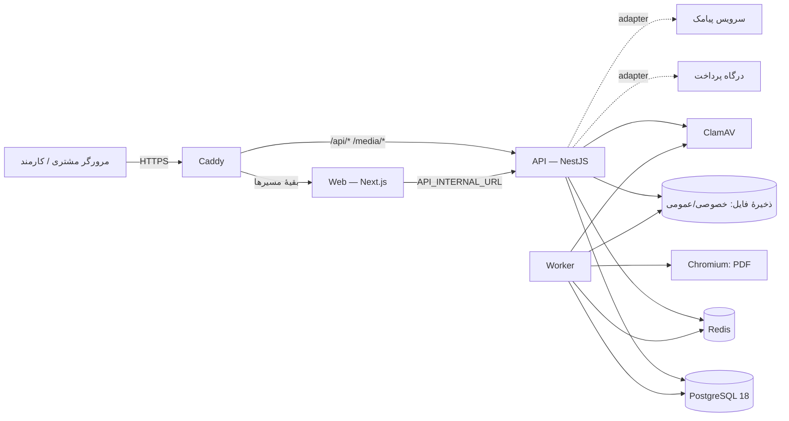
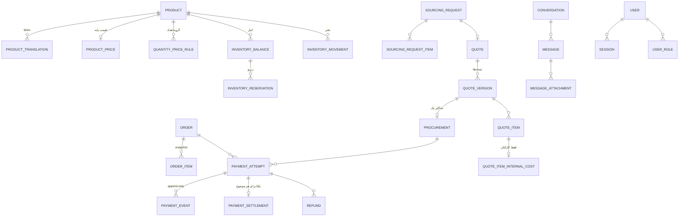
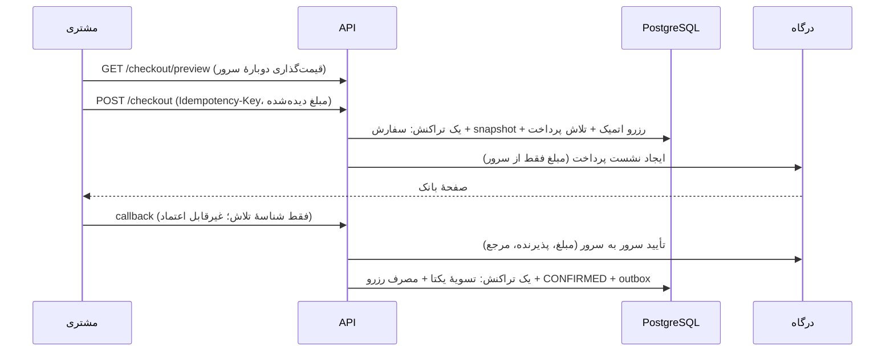
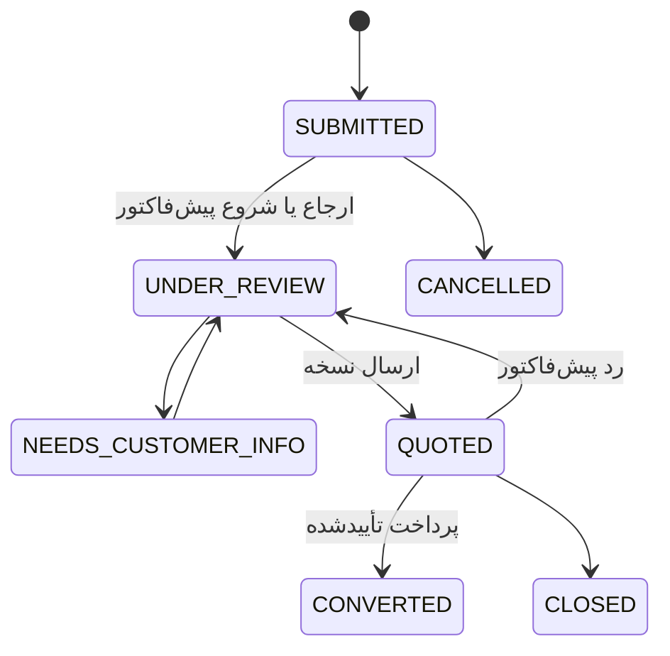

# معماری سورس | Source Architecture

- نسخه: ۱٫۰ (۲۰۲۶-۱۰-۰۳) — هم‌خوان با کد فعلی و آزمون‌های یکپارچه.
- تصمیم‌ها و دلیل‌ها: [`DECISIONS.md`](DECISIONS.md). قرارداد API: [`api/openapi.json`](api/openapi.json).

## ۱. نمای کلی

- **منبع حقیقت پایگاه داده است.** WebSocket فقط رویداد حمل می‌کند؛ پیام، پرداخت و موجودی همیشه از DB خوانده می‌شوند.
- **هیچ کار طولانی در درخواست وب انجام نمی‌شود.** اسکن فایل، پردازش Excel، رندر PDF، تطبیق پرداخت و انقضای رزرو در worker اجرا می‌شوند. تغییر تجاری و رویداد outbox در یک تراکنش ثبت می‌شوند تا با خاموشی ناگهانی گم نشوند.
- **زمان:** همهٔ زمان‌ها UTC ذخیره و مقایسه می‌شوند (هر اتصال PostgreSQL با `TimeZone=UTC`). نمایش به وقت تهران است: جلالی در فارسی، میلادی در انگلیسی.

## ۲. مخزن و مرز ماژول‌ها

| بسته | مسئولیت | وابستگی مجاز |
| --- | --- | --- |
| `packages/domain` | منطق تجاری خالص: پول و نرخ، اولویت قیمت، جمع سفارش/پیش‌فاکتور، سقف استرداد، ماشین‌های وضعیت، زمان تأمین و تقویم کاری، نرمال‌سازی جست‌وجوی فارسی، موبایل ایران، بازرسی فایل/zip، برنامهٔ import، RBAC | هیچ I/O |
| `packages/contracts` | اسکیماهای Zod درخواست، تایپ پاسخ‌ها، نام رویدادهای سوکت | domain (فقط تایپ) |
| `apps/api` | HTTP + WebSocket، Prisma، صف، ذخیرهٔ فایل | domain، contracts |
| `apps/worker` | اجرای رویدادهای outbox و کارهای زمان‌بندی‌شده، رندر PDF | ماژول‌های API (`@hedax/api/worker`) |
| `apps/web` | رابط فارسی/انگلیسی؛ بدون منطق تجاری | contracts، domain (فقط قالب‌بندی) |

### ماژول‌های API (`apps/api/src/modules`)

| ماژول | مسئولیت |
| --- | --- |
| `auth` | OTP مشتری، رمز + TOTP کارکنان، دعوت کارمند، نشست‌ها |
| `account` | پروفایل، نشانی‌ها، درخواست حساب تجاری |
| `catalog` | کاتالوگ عمومی و جست‌وجو؛ مدیریت محصول، تصویر، دسته، برند، قاعدهٔ قیمت |
| `pricing` | نرخ تبدیل (append-only) و حل قیمت |
| `inventory` | موجودی، رزرو اتمیک، دفتر حرکت |
| `cart`، `orders` | سبد، پیش‌نمایش checkout، شروع پرداخت، تسویهٔ سفارش موجودی، انتقال وضعیت و ارسال |
| `payments` | رجیستری ارائه‌دهنده، شبیه‌ساز، callback، تأیید سرور به سرور، تطبیق |
| `sourcing` | درخواست تأمین، پیش‌فاکتور نسخه‌دار، پذیرش، پرداخت، تأمین، سند PDF |
| `conversations` | گفت‌وگو (REST) و `ChatGateway` (Socket.IO)، یادداشت داخلی |
| `attachments` | بارگذاری، بازرسی، قرنطینه، اسکن، دانلود مجاز |
| `imports` | قالب، پیش‌نمایش، اعمال اتمیک و خروجی Excel |
| `returns` | لغو/مرجوعی و استرداد |
| `notifications` | اعلان داخل سایت و پیامک از outbox |
| `settings` | تنظیمات سایت، سیاست‌ها، روش‌های ارسال، تقویم کاری |
| `admin` | کارکنان و نقش‌ها، مشتریان، گزارش، audit، داشبورد |
| `health` | `live` و `ready` (DB، Redis، ذخیره، اسکنر، locale جست‌وجو) |

لایهٔ مشترک (`apps/api/src/common`): `AuthGuard` (نشست، CSRF، نوع حساب، MFA، مجوز)، context درخواست، فیلتر یکنواخت خطا، `PrismaService`، idempotency، outbox، ثبت انتقال وضعیت، audit، rate limit، `RealtimeBus` (pub/sub Redis)، درایورهای ذخیره و اسکنر.

### رابط وب (`apps/web`)

- مسیرها همیشه پیشوند زبان دارند: `/fa/...`، `/en/...`. گروه‌های مسیر: فروشگاه و حساب مشتری `(site)`، پنل مدیریت `admin`؛ صفحه‌های ۴۰۴ و خطای دوزبانه.
- اجزای سرور با `API_INTERNAL_URL` مستقیم API را صدا می‌زنند؛ اجزای کلاینت از `/api/v1` هم‌مبدأ (پشت Caddy مستقیم به API). پاسخ‌های خصوصی هرگز cache مشترک نمی‌گیرند. خواندن‌های عمومی (کاتالوگ، قیمت، موجودی، متن‌ها، اطلاعات تماس) ۶۰ تا ۳۰۰ ثانیه cache می‌شوند و برچسب مشترک `hedax-public` دارند. پس از هر تغییر مؤثر (کالا، قیمت، موجودی، نرخ، متن، سفارش، پرداخت)، API یا worker مسیر داخلی `/api/internal/revalidate` وب را با `REVALIDATE_SECRET` صدا می‌زند (چند تغییر پشت‌سرهم یک فراخوانی می‌شوند) تا این cache فوراً منقضی شود. پشت Caddy مسیر `/api/*` به API می‌رود، پس این مسیر از بیرون در دسترس نیست. checkout همیشه قیمت و موجودی تازهٔ سرور را بررسی می‌کند.
- حالت پیش‌نمایش `HEDAX_DATA_SOURCE=fixtures` دادهٔ نمونهٔ برچسب‌دار را بدون backend نشان می‌دهد و در build production مسدود است.

## ۳. مدل داده (PostgreSQL، `database/prisma/schema.prisma`)

- **پول:** `bigint` در کوچک‌ترین واحد (ریال؛ فلس برای درهم) همراه ارز صریح. مبلغ قابل پرداخت همیشه ریالی است. نرخ تبدیل در سفارش و نسخهٔ پیش‌فاکتور snapshot می‌شود.
- **حفاظت در سطح پایگاه داده:**
  - ۵۳ قید CHECK، از جمله نامنفی بودن مبالغ و `reserved ≤ on_hand`؛
  - ۷ ایندکس یکتای جزئی: یک رزرو فعال برای هر ردیف سفارش، یک پیش‌نویس برای هر پیش‌فاکتور، یک نسخهٔ منتشرشده برای هر نوع سیاست، یک عکس اصلی برای هر محصول، یک نشانی پیش‌فرض برای هر کاربر، یک انبار و یک تقویم کاری پیش‌فرض؛
  - قیدهای یکتای معمولی، از جمله یک تسویه برای هر سفارش/تأمین و یک سفارش تأمین برای هر نسخهٔ پیش‌فاکتور؛
  - trigger برای append-only بودن `audit_log`، `exchange_rate`، `inventory_movement`، `order_event`، `payment_event` و `payment_settlement`، و منع حذف محصول؛
  - ایندکس GIN `pg_trgm` برای جست‌وجوی فارسی.
- **تاریخچه:** هر انتقال وضعیت با فاعل، زمان، از/به و دلیل در `order_event` ثبت می‌شود؛ تغییرهای حساس در `audit_log`.

## ۴. جریان خرید موجودی و پرداخت

- **کلیک یا callback تکراری:** کلید idempotency پاسخ یکسان می‌دهد؛ تسویه یکتاست و رزرو فقط یک‌بار مصرف می‌شود (A09).
- **عدم تطابق مبلغ یا ادعای موفقیت از مرورگر:** هرگز موفقیت حساب نمی‌شود و پروندهٔ بررسی باز می‌شود (A10).
- **بسته‌شدن مرورگر:** صفحهٔ نتیجه یا job تطبیق، وضعیت را از درگاه استعلام می‌کند (A11).
- **انقضای رزرو:** پیش از آزادسازی با وضعیت پرداخت تطبیق می‌شود. موفقیت دیررس یا موجودی را دوباره اختصاص می‌دهد، یا سفارش را EXCEPTION می‌کند و پروندهٔ استرداد می‌سازد؛ وجه گم نمی‌شود (A12).
- **تغییر قیمت پس از بازبینی:** مبلغ دیده‌شده با مبلغ سرور مقایسه می‌شود و در صورت تفاوت ۴۰۹ `TOTAL_CHANGED` برمی‌گردد (A27).

## ۵. جریان تأمین سفارشی

1. مشتری درخواست را با هر برند (کد یا نام آزاد)، فایل و توضیح ثبت می‌کند. کد پیگیری و گفت‌وگوی اختصاصی ساخته می‌شود.
2. مدیر ارجاع می‌دهد و پیش‌نویس می‌سازد: اقلام، ارز پایه، نرخ ثبت‌شده، هزینه‌ها، زمان تأمین هر قلم، زمان حمل، شرایط و هزینهٔ داخلی که فقط کارکنان می‌بینند. ارسال، نسخهٔ قبلی را SUPERSEDED می‌کند و تاریخچه می‌ماند (A13).
3. مشتری همان نسخه را صریحاً می‌پذیرد؛ حداکثر یک سفارش تأمین در وضعیت `AWAITING_PAYMENT` ساخته می‌شود. «پذیرش» با «پرداخت» یکی نیست.
4. فقط پرداخت تأییدشده در سرور تأمین را شروع می‌کند (`PROCUREMENT_PENDING`). زمان وعده‌شده از لحظهٔ تأیید پرداخت محاسبه و ثبت می‌شود و تغییر بعدی آن دلیل و اعلان دارد (A14، A15).
5. سند PDF پیش‌فاکتور، فارسی و انگلیسی، از دادهٔ همان نسخه و بدون دادهٔ داخلی در worker ساخته می‌شود (A31).

## ۶. فایل‌ها، چت و Excel

- **فایل:** بازرسی اندازه، پسوند و محتوای واقعی (magic bytes، ساختار OOXML، ماکرو، رمزگذاری، zip bomb)، سپس ذخیرهٔ خصوصی با کلید تصادفی و وضعیت `SCANNING`. اسکن در worker انجام می‌شود (`READY` یا `REJECTED`) و تصویرها بازکدگذاری و EXIF آن‌ها حذف می‌شود. دسترسی برای هر شیء جداگانه بررسی می‌شود؛ دانلود اسناد همیشه به‌صورت `attachment` با `nosniff` و CSP sandbox است (A20، A21).
- **چت:** پیام پیش از تأیید (ack) ذخیره می‌شود و `clientMessageId` تکرار را حذف می‌کند (A16). مجوز در handshake، join، ارسال و resync، و پس از هر تغییر نقش یا ارجاع دوباره بررسی می‌شود؛ ابطال نشست سوکت باز را فوراً قطع می‌کند (A17، A19).
- **Excel:** بارگذاری، شروع idempotent، تجزیه و stage در worker، پیش‌نمایش با checksum و سپس اعمال در یک تراکنش با بررسی نسخه. هر تضاد یا `on_hand < reserved` کل فایل را رد می‌کند (A22 تا A25).

## ۷. امنیت

- **نشست:** کوکی `HttpOnly` و `SameSite=Lax` با توکن تصادفی که فقط hash آن در DB است؛ ابطال با `authVersion`.
- **CSRF:** بررسی Origin و توکن double-submit با HMAC وابسته به نشست.
- **دسترسی:** RBAC با مجوز ریز، محدودهٔ داده (همه یا ارجاع‌شده)، بدون امکان اعطای مجوزی که اعطاکننده ندارد، و محافظت از آخرین مالک.
- **MFA:** TOTP برای نقش‌های مالک و مالی، کدهای بازیابی و جلوگیری از استفادهٔ دوباره از کد.
- **محدودیت نرخ** برای OTP، ورود، جست‌وجو، چت، بارگذاری و درخواست؛ در production بدون Redis درخواست رد می‌شود (fail-closed).
- **لاگ:** JSON با شناسهٔ درخواست و حذف دادهٔ شخصی؛ پاسخ خطا هرگز SQL یا stack trace ندارد.
- **guard محیط:** در production، اجرا با شبیه‌ساز، پیامک توسعه، «بدون اسکن»، کوکی ناامن، آدرس http یا OpenAPI عمومی ممتنع است (A29).

## ۸. پس‌زمینه (worker)

| رویداد outbox | کار |
| --- | --- |
| `attachment.scan` | اسکن و بازکدگذاری فایل |
| `import.parse`، `import.commit` | پیش‌نمایش و اعمال Excel |
| `payment.reconcile` | استعلام دوبارهٔ پرداخت نامعلوم |
| `notification.send` | اعلان داخل سایت و پیامک |
| `quote.pdf.render` | PDF فارسی و انگلیسی پیش‌فاکتور |

کارهای زمان‌بندی‌شده: تطبیق پرداخت‌ها (هر دقیقه)، بررسی رزروهای منقضی (هر دقیقه)، انقضای پیش‌فاکتور و یادآوری (هر ۵ دقیقه)، لغو سفارش‌های رهاشده (هر ساعت)، ارسال پیامک (هر ۳۰ ثانیه) و پاک‌سازی (هر ساعت).

**انتقال کارها:** worker ردیف‌های سررسیدهٔ outbox را با `FOR UPDATE SKIP LOCKED` برمی‌دارد (چند worker هیچ‌وقت یک ردیف را دوبار برنمی‌دارند). در حالت پیش‌فرض (`QUEUE_DRIVER=bullmq`، الزامی در production) هر ردیف با شناسهٔ خودش به BullMQ/Redis می‌رود و کارهای زمان‌بندی‌شده job scheduler دارند. در حالت `inline` (فقط توسعه، بدون Redis) همان handlerها یکی‌یکی در فرایند worker اجرا می‌شوند و زمان‌بندی‌ها با timer انجام می‌شوند. در هر دو حالت، شکست یک handler ردیف را با تأخیر نمایی (حداکثر ۸ تلاش) به `PENDING` برمی‌گرداند. حلقهٔ برداشت و حالت `inline` آزمون یکپارچه روی PostgreSQL واقعی دارند (`70-worker-inline`)؛ انتقال BullMQ به‌دلیل نبود Redis اجرا نشده است.
